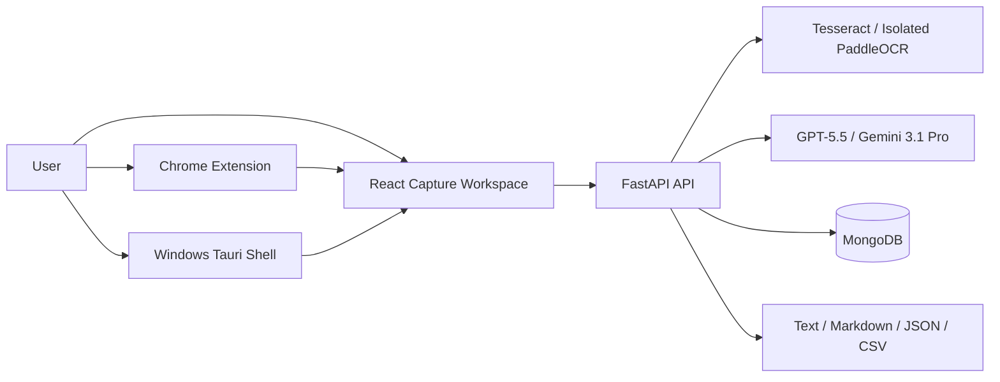
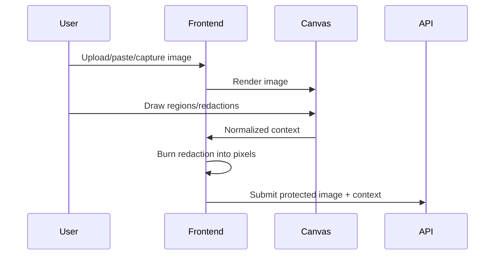
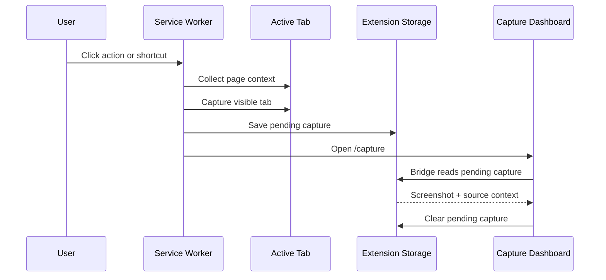

# Spatial AI Context Layer — Technical Reference

**Audience:** Engineering, architecture, security, QA, product, and design  
**System stage:** Functional MVP with Windows, Chrome, web, AI, OCR, export, and persistence foundations  
**Last updated:** 2026-07-10

---

## 1. Purpose

This document is the implementation-level source of truth for Spatial AI Context Layer. It describes:

- System architecture.
- Repository layout.
- Runtime services.
- Request and data models.
- Capture and processing flows.
- AI and OCR pipelines.
- Chrome extension behavior.
- Windows native behavior.
- Security and privacy controls.
- Packaging and code signing.
- Testing and validation.
- Operations and troubleshooting.
- File ownership and change procedures.

For product scope and roadmap, see `product.md`. For release status, see `release-review.md`. For onboarding and operational transfer, see `technical-handoff.md`.

---

## 2. System Context

Spatial AI turns an explicit screen capture into a structured context bundle that can be processed by deterministic OCR, multimodal AI, export services, or future workflow integrations.



### Architectural principles

1. Capture is explicit and user-triggered.
2. Redaction occurs before OCR or AI processing.
3. AI credentials remain server-side.
4. Deterministic OCR is separate from generative interpretation.
5. Temporary mode avoids persistence.
6. Native runtime failures must not terminate the API.
7. Physical image dimensions are authoritative for mixed-DPI capture.
8. MongoDB implementation details must not leak through API responses.

---

## 3. Repository Layout

```text
/app
├── backend/
│   ├── server.py
│   ├── ocr_service.py
│   ├── paddle_worker.py
│   ├── export_service.py
│   ├── requirements.txt
│   ├── .env
│   └── tests/
│       └── test_api.py
├── frontend/
│   ├── package.json
│   ├── yarn.lock
│   ├── .env
│   ├── public/
│   └── src/
│       ├── App.js
│       ├── App.css
│       ├── mobile.css
│       ├── index.css
│       ├── pages/
│       ├── components/
│       └── lib/
├── extension/
│   ├── manifest.json
│   ├── background.js
│   ├── bridge.js
│   ├── README.md
│   ├── VALIDATION.md
│   ├── validation-results.json
│   └── tests/
├── desktop/
│   ├── src-tauri/
│   │   ├── Cargo.toml
│   │   ├── Cargo.lock
│   │   ├── tauri.conf.json
│   │   ├── tauri.windows.conf.json
│   │   ├── sign-artifact.ps1
│   │   ├── capabilities/
│   │   ├── icons/
│   │   └── src/main.rs
│   ├── build-windows.ps1
│   ├── validate-hardware.ps1
│   ├── HARDWARE_VALIDATION.md
│   └── README.md
├── .github/workflows/
│   └── windows-installers.yml
├── memory/
│   └── PRD.md
├── product.md
├── technical.md
├── release-review.md
└── technical-handoff.md
```

---

## 4. Runtime Architecture

### 4.1 Frontend

The frontend is a React single-page application served on port 3000 by the managed runtime.

Responsibilities:

- Accept screenshot input.
- Render the capture workspace.
- Track regions and annotations.
- Burn redaction strokes into image pixels.
- Trigger deterministic OCR.
- Trigger multimodal AI analysis.
- Parse streaming AI events.
- Copy or download outputs.
- Display and manage capture history.
- Receive browser extension captures.
- Receive Windows native captures.

### 4.2 Backend

The backend is a FastAPI application bound to `0.0.0.0:8001` by the managed supervisor.

Responsibilities:

- Validate image and request payloads.
- Normalize provider image input.
- Execute OCR.
- Isolate PaddleOCR.
- Route AI requests.
- Stream AI output.
- Store and retrieve captures.
- Render structured exports.

### 4.3 Database

MongoDB stores non-temporary capture history.

The backend connects only through:

- `MONGO_URL`
- `DB_NAME`

The primary collection is `captures`.

### 4.4 Browser extension

The extension is a Chrome Manifest V3 package with:

- Service worker.
- Visible-tab capture.
- Script-based page enrichment.
- Extension storage handoff.
- Scoped dashboard bridge.

### 4.5 Windows desktop

The Windows shell is a Tauri 2 application.

Responsibilities:

- Register the global shortcut.
- Identify the display under the cursor.
- Hide the capture window before capture.
- Capture one or all displays.
- Restore and focus the workspace.
- Pass native screenshots and display metadata to React.
- Write results to the Windows clipboard.
- Generate hardware diagnostics.

---

## 5. Environment Configuration

### Backend variables

| Variable | Purpose | Required |
| --- | --- | --- |
| `MONGO_URL` | MongoDB connection string | Yes |
| `DB_NAME` | MongoDB database name | Yes |
| `CORS_ORIGINS` | Allowed frontend origins | Yes |
| `OPENAI_API_KEY` / `OPENAI_MODEL` | Server-side OpenAI key + model id (default `gpt-4o`), backs the `gpt-5.5` model option | Yes for that model |
| `GEMINI_API_KEY` / `GEMINI_MODEL` | Server-side Gemini key + model id (default `gemini-2.0-flash`), backs the `gemini-3.1-pro-preview` model option | Yes for that model |
| `OPENROUTER_API_KEY` / `OPENROUTER_MODEL` | Server-side OpenRouter key + routed model id (default `openai/gpt-4o-mini`), backs the `openrouter` model option | Yes for that model |
| `GROQ_API_KEY` / `GROQ_MODEL` | Server-side Groq key + model id (default `meta-llama/llama-4-scout-17b-16e-instruct`), backs the `groq` model option | Yes for that model |
| `TESSERACT_CMD` | Explicit path to the Tesseract binary, used when it isn't on `PATH` | No |

### Frontend variables

| Variable | Purpose | Required |
| --- | --- | --- |
| `REACT_APP_BACKEND_URL` | External backend base URL | Yes |

Frontend API calls must always use:

```javascript
process.env.REACT_APP_BACKEND_URL
```

### Windows signing variables

| Variable | Purpose | Required for signed build |
| --- | --- | --- |
| `WINDOWS_CERT_PATH` | Path to local PFX file | Yes |
| `WINDOWS_CERT_PASSWORD` | PFX password | Yes |
| `TIMESTAMP_URL` | RFC3161 timestamp endpoint | Yes |

### Configuration rules

- Do not commit secrets.
- Do not add fallback production URLs.
- Do not replace protected environment values.
- Do not expose the AI key in React, the extension, or Tauri JavaScript.
- Do not store the PFX or password in the repository.

---

## 6. Frontend Application Structure

### Routes

| Route | Page | Responsibility |
| --- | --- | --- |
| `/capture` | `CapturePage.jsx` | Main capture, OCR, export, and AI workflow |
| `/history` | `HistoryPage.jsx` | Search, inspect, and delete captures |
| `/platforms` | `PlatformsPage.jsx` | Platform setup and status |
| `/settings` | `SettingsPage.jsx` | Persistent privacy preferences |

### Application shell

`frontend/src/components/AppShell.jsx` owns:

- Primary navigation.
- Current section heading.
- Global status indicator.
- Desktop and mobile navigation behavior.

### Capture canvas

`frontend/src/components/CaptureCanvas.jsx` owns:

- Pointer input.
- Rectangle drafting.
- Region normalization.
- Region numbering.
- Freehand points.
- Redaction points.
- Annotation SVG rendering.

Region coordinates are normalized to a `0..1` range:

```json
{
  "x": 0.21,
  "y": 0.14,
  "width": 0.32,
  "height": 0.27
}
```

### Command bar

`frontend/src/components/CommandBar.jsx` owns:

- Action selection.
- Model selection.
- Instruction entry.
- Submit state.
- Processing state.

### Export controls

`frontend/src/components/ExportBar.jsx` owns:

- Export format selection.
- Backend render request.
- Clipboard copy.
- File download.
- Permission-safe error handling.

### Native bridge

`frontend/src/lib/native.js` detects Tauri through `window.__TAURI_INTERNALS__`.

It provides:

- Native capture event subscription.
- Active-display command invocation.
- All-display command invocation.
- Native clipboard writing.
- Browser clipboard fallback.

---

## 7. Screenshot Input Pipeline

### Supported input sources

- File picker.
- Clipboard paste.
- Drag-and-drop.
- Chrome extension.
- Windows active display.
- Windows all displays.

### Supported media types

- `image/png`
- `image/jpeg`
- `image/webp`

### Maximum payload

8 MB of decoded image bytes.

### Input sequence



---

## 8. Redaction Pipeline

Redaction is implemented in `CapturePage.jsx` by `applyRedactions`.

### Processing steps

1. Filter annotations to `type === "redaction"`.
2. Load the source image into an HTML canvas.
3. Draw the original image.
4. Convert normalized annotation points to image pixels.
5. Draw opaque black strokes.
6. Export the resulting canvas in the source media type.
7. Send only the redacted result to OCR or AI.

### Security invariant

No downstream OCR or AI call should receive the original image after a redaction exists.

Any new processing path must call the redaction function before transmission.

---

## 9. API Models

### Region

```json
{
  "id": "uuid",
  "x": 0.1,
  "y": 0.2,
  "width": 0.3,
  "height": 0.4,
  "label": "Region 1"
}
```

Constraints:

- Coordinates are normalized.
- Width and height must be greater than zero.
- Maximum 12 regions per request.

### Annotation

```json
{
  "id": "uuid",
  "type": "freehand",
  "points": [{"x": 0.2, "y": 0.3}],
  "label": null
}
```

Supported types:

- `freehand`
- `redaction`
- `label`

### Source context

```json
{
  "application": "Google Chrome",
  "window_title": "Production Dashboard",
  "url": "https://example.com/dashboard",
  "displays": [],
  "page_context": {}
}
```

### Analyze request

Important fields:

- `image_data`
- `mime_type`
- `instruction`
- `action`
- `model`
- `regions`
- `annotations`
- `source`
- `private_mode`
- `ocr_text`

### Capture response

Important fields:

- `id`
- `created_at`
- `instruction`
- `action`
- `model`
- `result`
- `regions`
- `annotations`
- `source`
- `thumbnail`
- `ocr_text`

---

## 10. Backend API Reference

### `GET /api/`

Health and product identity.

### `GET /api/models`

Returns supported AI models.

### `POST /api/captures/analyze`

Starts a streaming AI analysis.

Response media type:

```text
text/event-stream
```

Event types:

```json
{"type":"delta","content":"partial text"}
```

```json
{"type":"done","capture":{},"saved":true}
```

```json
{"type":"error","message":"provider error"}
```

### `GET /api/captures`

Returns up to 100 captures, newest first.

Query parameters:

- `search`
- `refresh`

Search targets:

- Instruction.
- Result.
- Source window title.

### `GET /api/captures/{capture_id}`

Returns one capture.

### `DELETE /api/captures/{capture_id}`

Deletes one capture.

### `GET /api/ocr/status`

Returns OCR engine availability and isolation mode.

### `POST /api/ocr/extract`

Runs deterministic OCR.

Request fields:

- `image_data`
- `mime_type`
- `engine`
- `language`
- `regions`

### `POST /api/exports/render`

Renders a text, Markdown, JSON, or CSV export.

---

## 11. AI Processing Pipeline

### Image validation

`parse_image_data`:

1. Removes an accepted data-URL prefix.
2. Strictly base64-decodes the payload.
3. Rejects empty input.
4. Rejects decoded input larger than 8 MB.

### Image canonicalization

`canonical_image_base64`:

1. Decodes with Pillow.
2. Loads the full image.
3. Converts unsupported color modes.
4. Resizes dimensions above 4096 pixels.
5. Encodes a canonical PNG.

This avoids provider-specific failures caused by unusual PNG chunks, palette modes, or inconsistent MIME declarations.

### Model routing

`openai`, `openrouter`, and `groq` all speak the OpenAI chat-completions wire format, so they share one streaming code path (`stream_openai_deltas`) and differ only by API key, base URL, and model id. `gemini` uses the Google `google-genai` SDK directly (`stream_gemini_deltas`).

| UI model id | Provider | Real model (env-configurable) |
| --- | --- | --- |
| `gpt-5.5` | OpenAI | `OPENAI_MODEL`, default `gpt-4o` |
| `gemini-3.1-pro-preview` | Google | `GEMINI_MODEL`, default `gemini-2.0-flash` |
| `openrouter` | OpenRouter | `OPENROUTER_MODEL`, default `openai/gpt-4o-mini` |
| `groq` | Groq | `GROQ_MODEL`, default `meta-llama/llama-4-scout-17b-16e-instruct` |

### Context prompt

The model receives:

- Task mode.
- User instruction.
- Source metadata.
- Regions.
- Annotations.
- Deterministic OCR text.
- Privacy instruction regarding redacted content.

### Streaming behavior

- A fresh chat session is created per analysis.
- Text deltas are forwarded immediately.
- A completed result is assembled server-side.
- Non-temporary results are stored after successful completion.
- The frontend enforces a 150-second timeout.
- The frontend rejects streams without a `done` event.

---

## 12. OCR Architecture

### Primary engine

Tesseract runs in-process through `pytesseract`.

Configuration:

```text
--psm 11
```

### Region processing

Each selected region is converted from normalized coordinates to pixel bounds, cropped, and processed separately.

Word boxes are translated back into source-image coordinates.

### Line reconstruction

Words are grouped by:

- Region.
- Block number.
- Paragraph number.
- Line number.

### Confidence

Tesseract confidence is normalized from `0..100` to `0..1`.

### Paddle isolation

`ocr_service.py` starts `paddle_worker.py` as a subprocess.

Isolation protects the API from:

- Native library segmentation faults.
- Model initialization crashes.
- Paddle runtime incompatibility.
- Long-running model initialization.

The worker:

1. Receives an image path.
2. Initializes PaddleOCR.
3. Writes word results to a JSON path.
4. Exits.

The parent enforces a 120-second timeout.

### Auto fallback

1. Run Tesseract.
2. Return immediately when text exists and average confidence is at least 0.55.
3. Otherwise attempt PaddleOCR.
4. Compare available results.
5. If Paddle fails, return Tesseract without terminating the API.

---

## 13. Export Architecture

`backend/export_service.py` produces deterministic output.

### Text

Returns extracted text without additional structure.

### Markdown

Returns:

- Heading.
- Extracted content.
- Source footer.

### JSON

Returns:

- Title.
- Source context.
- Full OCR payload.
- Words and boxes.
- Confidence.

### CSV

Columns:

- `region`
- `text`
- `confidence`
- `x`
- `y`
- `width`
- `height`

---

## 14. MongoDB Persistence

### Collection

```text
captures
```

### Persistence rule

```text
private_mode == true  → do not insert
private_mode == false → insert after successful analysis
```

### Serialization rules

- Use UUID strings for public identifiers.
- Store timestamps as timezone-aware ISO strings.
- Query with `{"_id": 0}`.
- Never return a MongoDB `ObjectId`.
- Do not reuse a dictionary mutated by `insert_one` as an API response.

### Search

Search uses escaped case-insensitive regular expressions against selected fields.

---

## 15. Chrome Extension Architecture

### Manifest capabilities

- `activeTab`
- `tabs`
- `storage`
- `scripting`
- `unlimitedStorage`
- `<all_urls>` host access

### Capture flow



### Page enrichment

The extension collects bounded values for:

- Page title.
- Canonical URL.
- Description.
- Selected text.
- Headings.
- Visible text.
- Links.
- Viewport dimensions.
- Device pixel ratio.

### Storage

Important keys:

- `pendingCapture`
- `lastCaptureStatus`
- `dashboardUrl`

### Restricted pages

Chrome internal pages may reject screenshot or script access. This is expected browser behavior and must fail safely.

---

## 16. Windows Native Architecture

### Rust dependencies

- `tauri`
- `tauri-plugin-global-shortcut`
- `tauri-plugin-clipboard-manager`
- `xcap`
- `image`
- `base64`
- `windows`

### Tauri commands

- `list_monitors`
- `capture_active_monitor`
- `capture_all_monitors`

### Active monitor capture

1. Read cursor position.
2. Hide the workspace.
3. Wait 140 ms.
4. Resolve monitor at cursor coordinates.
5. Capture the monitor.
6. Encode PNG as a data URL.
7. Restore, maximize, and focus the workspace.

### All-monitor capture

1. Enable Per-Monitor V2 awareness.
2. Enumerate monitors.
3. Capture each monitor at native bitmap resolution.
4. Preserve signed monitor coordinates.
5. Calculate negative and positive virtual bounds.
6. Allocate a physical-pixel canvas.
7. Overlay each monitor using physical offsets.
8. Return the stitched image and display metadata.

### Display metrics

The native payload includes:

- Display ID.
- Friendly name.
- X and Y coordinates.
- Metadata width and height.
- Capture width and height.
- Reported scale factor.
- Capture-to-metadata scale ratios.
- Primary-display status.
- Metadata/capture consistency.

### DPI awareness

The application calls:

```text
SetProcessDpiAwarenessContext(DPI_AWARENESS_CONTEXT_PER_MONITOR_AWARE_V2)
```

This occurs before monitor enumeration and Tauri window startup.

---

## 17. Mixed-DPI Diagnostics

The installed executable supports:

```powershell
spatial-ai-context-layer.exe --hardware-report C:\path\report.json
```

Outputs:

- JSON report.
- Stitched PNG with the same base filename.

### Automated checks

- Per-Monitor V2 activation.
- Capture dimensions versus monitor metadata.
- Mixed scale-factor detection.
- Virtual desktop bounds.
- Horizontal and vertical monitor adjacency.
- Seam delta of at most two physical pixels.

### Exit codes

| Code | Meaning |
| --- | --- |
| `0` | Hardware checks passed |
| `2` | Probe or file error |
| `3` | Alignment checks completed but failed |

---

## 18. Windows Packaging

### Installer targets

- NSIS `.exe`
- WiX `.msi`

### Package configuration

Primary configuration:

```text
desktop/src-tauri/tauri.conf.json
```

Windows-specific signing configuration:

```text
desktop/src-tauri/tauri.windows.conf.json
```

### Build command

```powershell
powershell -ExecutionPolicy Bypass -File .\desktop\build-windows.ps1
```

### Signing

Tauri calls:

```text
desktop/src-tauri/sign-artifact.ps1
```

The script:

1. Validates signing environment variables.
2. Locates `signtool.exe`.
3. Signs with SHA-256.
4. Applies RFC3161 timestamping.
5. Verifies Authenticode status.
6. Fails the build on invalid status.

### Build outputs

```text
desktop/src-tauri/target/release/bundle/nsis/*.exe
desktop/src-tauri/target/release/bundle/msi/*.msi
desktop/src-tauri/target/release/bundle/signed-package-manifest.json
```

The manifest includes:

- File path.
- Size.
- SHA-256.
- Signature status.
- Signer subject.
- Timestamp certificate subject.

---

## 19. Physical Hardware Validation

Command:

```powershell
powershell -ExecutionPolicy Bypass -File .\desktop\validate-hardware.ps1
```

Default behavior:

- Windows 10 selects NSIS.
- Windows 11 selects MSI.
- Verifies installer signature.
- Performs silent install.
- Locates the installed executable.
- Verifies executable signature.
- Runs the native hardware report.
- Requires at least two monitors.
- Expects 100% and 150% baseline scaling.
- Writes a ZIP evidence package.

Physical execution remains pending until the certificate-enabled Windows machines are available.

---

## 20. Security Model

### Trust boundaries

1. Screen content enters through explicit user action.
2. Frontend performs pixel redaction.
3. Backend validates and normalizes images.
4. OCR runs locally.
5. AI processing uses a server-side key.
6. Persistence is conditional.

### Sensitive assets

- Screen captures.
- OCR text.
- AI prompts and output.
- Source URLs and titles.
- Browser page context.
- AI key.
- PFX certificate and password.

### Current controls

- Explicit capture only.
- Temporary mode.
- Pixel-level redaction.
- Server-side credentials.
- Input validation.
- Payload size limits.
- MongoDB response projection.
- Isolated native OCR fallback.
- Authenticode signing pipeline.

### Security gaps to address

- Automatic sensitive-data detection.
- Encrypted capture payloads at application level.
- Configurable retention cleanup.
- Enterprise provider policy.
- Audit events for future automated actions.
- Browser extension permission minimization review.

---

## 21. Testing Strategy

### Backend

Current regression coverage includes 19 passing tests across:

- API health.
- Model discovery.
- Validation errors.
- Capture history.
- OCR status.
- Deterministic OCR.
- Region extraction.
- Paddle fallback safety.
- Structured exports.
- AI image analysis paths.

### Frontend

Validated behaviors include:

- Route loading.
- Desktop and mobile layout.
- Image upload.
- OCR rendering.
- Export download.
- Clipboard failure handling.
- GPT analysis after OCR.
- History loading.
- Privacy setting persistence.

### Extension

Real-site matrix:

- GitHub.
- Wikipedia.
- Amazon.
- Stack Overflow.
- Vercel.
- Grafana.
- Three.js.

### Windows

Completed:

- Rust formatting.
- `x86_64-pc-windows-msvc` target compilation.
- Static signing and validation review.

Pending:

- Real PFX signing.
- Windows 10 NSIS install.
- Windows 11 MSI install.
- Physical 100%/150% monitor report.

---

## 22. Service Operations

### Service control

```bash
sudo supervisorctl restart backend
sudo supervisorctl restart frontend
```

Restart only after:

- Dependency installation.
- Environment changes.
- Service startup failure.

Regular source edits use hot reload.

### Backend logs

```text
/var/log/supervisor/backend.err.log
```

### Frontend logs

```text
/var/log/supervisor/frontend.err.log
```

### API testing

Always use the external URL from `frontend/.env`.

Do not use manually constructed production URLs.

---

## 23. Troubleshooting

### Backend does not start

Check:

1. Python syntax.
2. Missing dependencies.
3. Backend supervisor log.
4. `MONGO_URL` and `DB_NAME` presence.
5. OCR native dependency availability.

### AI stream ends without output

Check:

1. Backend error event.
2. Provider model identifier.
3. AI key availability.
4. Canonical image conversion.
5. Input size.
6. Stream timeout.

### GPT rejects an image

Ensure the backend passes the canonical PNG result rather than the original payload.

### OCR returns no text

Check:

1. Image contains visible features.
2. Region coordinates include text.
3. Tesseract binary is installed.
4. Requested language model exists.
5. Redaction did not cover the content.

### Paddle crashes

Expected handling:

- Worker exits.
- Main API remains healthy.
- Tesseract fallback returns.

If the API process exits, Paddle was imported into the main process and isolation has been broken.

### History is stale

Ensure frontend fetch uses:

- `cache: "no-store"`
- Refresh query value.

### Clipboard copy fails

The UI should:

1. Try the Clipboard API.
2. Try the hidden-textarea fallback.
3. Show an error toast.
4. Preserve download as an alternative.

### Extension opens without capture

Check:

1. `lastCaptureStatus` in extension storage.
2. Host permissions.
3. Restricted-page status.
4. Dashboard URL.
5. Content bridge match pattern.

### Mixed-DPI seam fails

Inspect:

- `per_monitor_v2`.
- Metadata width/height.
- Capture width/height.
- Scale factor.
- Signed X/Y coordinates.
- Seam delta.
- Stitched PNG.

Do not compensate with CSS scaling; fix native physical coordinate mapping.

### Windows signature invalid

Check:

1. PFX path.
2. Password.
3. Certificate validity.
4. Windows SDK installation.
5. Timestamp endpoint.
6. Installed executable signature, not only installer signature.

---

## 24. File Ownership Matrix

| File or area | Primary responsibility | Typical owner |
| --- | --- | --- |
| `backend/server.py` | API routes, models, AI streaming, persistence | Backend engineer |
| `backend/ocr_service.py` | OCR orchestration and fallback | ML/platform engineer |
| `backend/paddle_worker.py` | Isolated Paddle runtime | ML/platform engineer |
| `backend/export_service.py` | Deterministic export formats | Backend engineer |
| `backend/tests/test_api.py` | Backend and API regressions | QA/backend engineer |
| `frontend/src/pages/CapturePage.jsx` | End-to-end capture workflow | Frontend engineer |
| `frontend/src/components/CaptureCanvas.jsx` | Selection and annotation geometry | Frontend/graphics engineer |
| `frontend/src/components/CommandBar.jsx` | AI command interaction | Frontend engineer |
| `frontend/src/components/ExportBar.jsx` | Export copy/download | Frontend engineer |
| `frontend/src/lib/api.js` | API transport and SSE parsing | Frontend engineer |
| `frontend/src/lib/native.js` | Tauri bridge and clipboard | Frontend/native engineer |
| `frontend/src/App.css` | Desktop visual system | Design systems engineer |
| `frontend/src/mobile.css` | Responsive overrides | Design systems engineer |
| `extension/background.js` | Browser capture and enrichment | Extension engineer |
| `extension/bridge.js` | Extension-to-dashboard transfer | Extension/frontend engineer |
| `extension/tests/` | Unpacked extension validation | QA/extension engineer |
| `desktop/src-tauri/src/main.rs` | Native capture, DPI, diagnostics | Rust/Windows engineer |
| `desktop/src-tauri/tauri.conf.json` | Product packaging | Release engineer |
| `desktop/src-tauri/tauri.windows.conf.json` | Windows signing hook | Release/security engineer |
| `desktop/src-tauri/sign-artifact.ps1` | PFX signing | Release/security engineer |
| `desktop/build-windows.ps1` | Signed package build | Release engineer |
| `desktop/validate-hardware.ps1` | Physical Windows verification | QA/release engineer |
| `.github/workflows/windows-installers.yml` | Windows build automation | Release engineer |
| `product.md` | Product scope | Product lead |
| `technical.md` | Technical source of truth | Technical lead |
| `release-review.md` | Release gate record | Release lead |
| `technical-handoff.md` | Operational transfer | Technical lead |

---

## 25. Change Procedures

### Changing an API request or response

1. Update Pydantic models.
2. Update route implementation.
3. Confirm Mongo serialization safety.
4. Update frontend API client.
5. Update UI consumers.
6. Add regression tests.
7. Update this document.

### Adding an AI model

1. Confirm exact provider/model support.
2. Add backend routing entry.
3. Add frontend selector option.
4. Validate image input.
5. Test streaming deltas, completion, timeout, and errors.
6. Confirm private mode.
7. Update model documentation.

### Adding an OCR engine

1. Decide whether it can safely run in-process.
2. Isolate native runtimes by default.
3. Normalize word and box output.
4. Add confidence handling.
5. Add timeout and crash fallback.
6. Add API tests.
7. Update engine status output.

### Changing selection geometry

1. Test multiple aspect ratios.
2. Test mobile and desktop.
3. Confirm region coordinates map to original image pixels.
4. Confirm redaction alignment.
5. Confirm OCR crop alignment.
6. Confirm AI context coordinates.

### Changing native monitor capture

1. Preserve PMv2 activation before monitor enumeration.
2. Preserve signed coordinates.
3. Use capture bitmap dimensions.
4. Cross-compile Windows target.
5. Run physical mixed-DPI validator.
6. Compare stitched PNG and seam metrics.
7. Update hardware evidence.

### Changing signing or packaging

1. Never commit the certificate.
2. Preserve sign-command `%1` placeholder.
3. Sign inner executable and installers.
4. Require RFC3161 timestamp.
5. Verify Authenticode.
6. Write artifact hashes.
7. Run clean Windows installation.

### Changing Chrome permissions

1. Document the new capability.
2. Confirm necessity.
3. Test restricted pages.
4. Re-run the seven-site matrix.
5. Review storage and privacy implications.

---

## 26. Technical Debt

### High priority

- Physical Windows signing and monitor reports.
- Region/image coordinate correction for letterboxed images.
- Resizable and movable selection regions.
- Automatic retention cleanup.
- Multi-language OCR packaging.

### Medium priority

- Split large React page modules further.
- Add typed frontend API models.
- Add explicit OCR result response models.
- Add database indexes for history search.
- Add capture thumbnail compression.
- Add browser extension options UI.

### Future

- Object storage for larger capture history.
- Encrypted history payloads.
- Team and account boundaries.
- Workflow integration service.
- Observability metrics and tracing.

---

## 27. Technical Definition of Done

A change is complete when:

1. Code is implemented end-to-end.
2. Security and privacy invariants remain intact.
3. Relevant backend tests pass.
4. Frontend production build passes.
5. Browser behavior is exercised.
6. Native changes cross-compile for Windows.
7. Hardware changes have physical evidence when required.
8. Release review is updated.
9. Technical handoff notes are updated.
10. Known limitations are documented without overstating validation.
